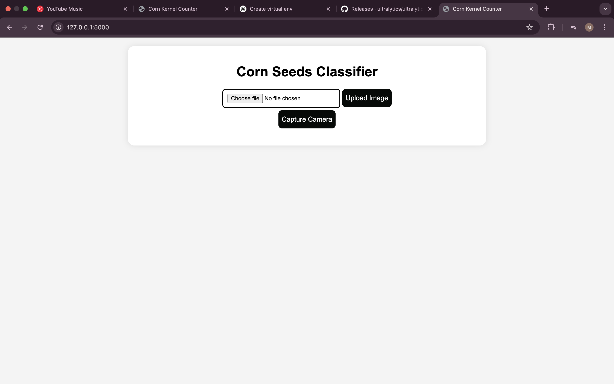
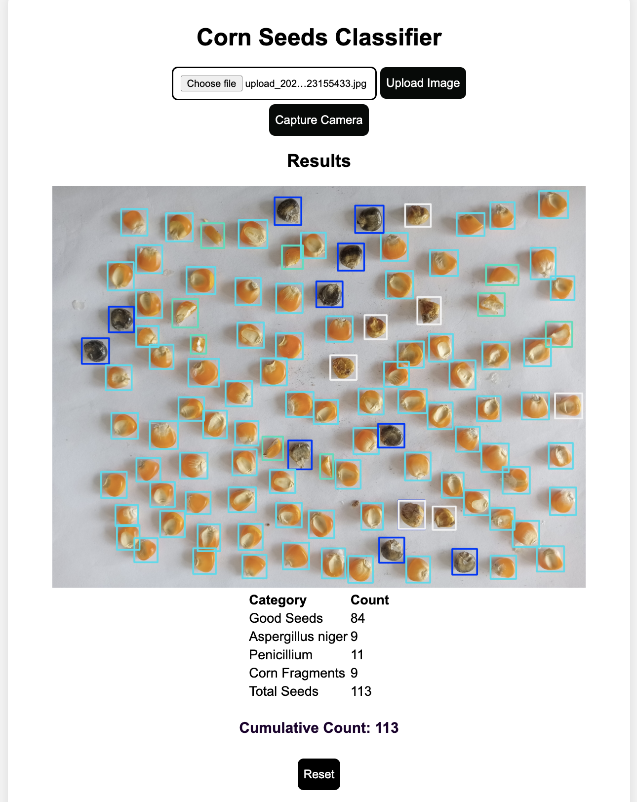

## Project Description

This application allows users to upload images or capture images from a camera, then uses a trained YOLO model to detect and classify corn kernels into categories (black, corn, white, and fragments). It provides count statistics for each category and maintains a cumulative count.

## Documentation

### Application Interface


The application provides a simple web interface where users can upload images or capture photos using their camera. The processed images are displayed along with classification results.

### Detection Results


After processing, the application displays the analyzed image with detected corn kernels and a detailed breakdown of kernel counts by category:

| Category | Description |
|----------|-------------|
| Good Seeds | Healthy corn kernels with no infection |
| Aspergillus niger | Kernels infected with the Aspergillus niger fungus, a common mycotoxin-producing mold that appears as black spots |
| Penicillium | Kernels infected with Penicillium fungi, which typically appears as blue-green or black mold on corn |
| Corn Fragments | Broken or partial corn kernel pieces |
| Total Seeds | The total count of all detected kernels and fragments |

The application also maintains a cumulative count of detected kernels across multiple images, which can be reset as needed.

### Model Information

This application uses a custom-trained YOLOv8 model for corn kernel detection and classification. The model achieves impressive accuracy:

- **mAP**: 99.2%
- **Precision**: 98.2%
- **Recall**: 97.7%

#### Access the Model
You can access, duplicate, or experiment with our model on Roboflow:  
[Corn Detection Model](https://universe.roboflow.com/letsgo-itmav/corn_detect-3by1j/model/2)

The dataset is available for download through the Roboflow platform, allowing you to train your own models or modify our approach for similar detection tasks.
## Setup Instructions

### Prerequisites

- Python 3.x
- Pip package manager

### Installation

1. Clone the repository or download the project files

2. Create and activate a virtual environment (optional but recommended):
   ```sh
   python -m venv env
   source env/bin/activate  # On Windows: env\Scripts\activate
   ```

3. Install the required dependencies:
   ```sh
   pip install flask opencv-python ultralytics werkzeug
   ```

4. Ensure the YOLO model file (`best.pt`) is in the model directory

5. Make sure all required directories exist:
   ```sh
   mkdir -p check results static templates uploads
   ```

### Configuration

You may need to update the file paths in app.py to match your system:
```python
UPLOAD_FOLDER = '/path/to/your/project/check'
RESULTS_FOLDER = '/path/to/your/project/results'
STATIC_FOLDER = '/path/to/your/project/static'
```

## Running the Application

1. Start the Flask server:
   ```sh
   python app.py
   ```

2. Open a web browser and navigate to:
   ```
   http://127.0.0.1:5000/
   ```

## Usage

1. The application provides two ways to submit images:
   - Upload an image file
   - Capture an image using your camera

2. After processing, the application will:
   - Display the processed image with detections
   - Show counts for each kernel type (black, corn, white, fragments)
   - Display the total kernel count
   - Show the cumulative count across all processed images

3. You can reset the cumulative count using the reset button

## Project Structure

- app.py: Main Flask application
- best.pt: YOLO model trained for corn kernel detection
- index.html: HTML template for the web interface
- check: Temporary storage for uploaded images
- results: Directory for saving processed images
- static: Static files served by the application
- uploads: Directory for storing uploaded files

## Technologies Used

- Flask: Web framework
- OpenCV: Image processing
- Ultralytics YOLO: Object detection model
- JavaScript/HTML/CSS: Frontend

## License

[agungferdi]
thanks